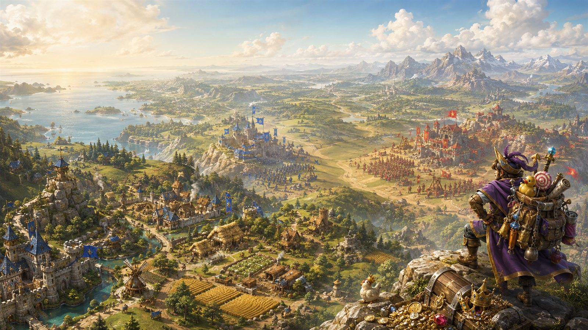
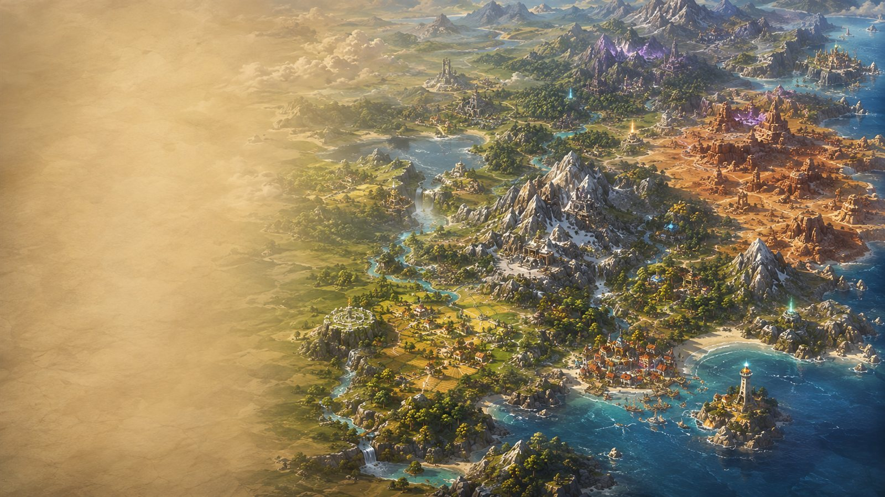

# 🗺️ Hexrealms

**Settlers + Risk + Munchkin, on one shared hex world.**

A browser-based, turn-based hex world-builder for 2–6 players. Everyone builds their empire on the
*same* shared map — a Catan-style tile economy, a Risk-style war for territory, and a Munchkin-style
leveling hero who fights monsters, loots gear, and can permanently die doing it.

### ▶️ [Play now — playelenor.netlify.app](https://playelenor.netlify.app/)

No install, no account. Pick **Hotseat** to play solo/pass-and-play instantly, or **P2P** to play
live with friends over a shareable link.

| | | |
|---|---|---|
|  |  |  |

---

## Contents

- [How a turn works](#how-a-turn-works)
- [Setup](#setup)
- [The economy — tiles, stockpiles, and hauling](#the-economy--tiles-stockpiles-and-hauling)
- [Buildings](#buildings)
- [The Town (Capital upgrades)](#the-town-capital-upgrades)
- [The gear economy — Craft Gear and Sell Loot](#the-gear-economy--craft-gear-and-sell-loot)
- [Roads — the logistics shortcut](#roads--the-logistics-shortcut)
- [Heroes — classes, leveling, and gear](#heroes--classes-leveling-and-gear)
- [The Munchkin layer — the Door deck](#the-munchkin-layer--the-door-deck)
- [Combat](#combat)
- [Territory war (the Risk layer)](#territory-war-the-risk-layer)
- [Victory Points & winning](#victory-points--winning)
- [Play modes](#play-modes)
- [Running it locally](#running-it-locally)
- [Tech stack & architecture](#tech-stack--architecture)
- [Docs](#docs)

---

## How a turn works

Every player's turn moves through six phases, in order, every round:

| # | Phase | What happens |
|---|---|---|
| 0 | **Production** | Automatic. Territory you've held long enough is claimed (see [Territory war](#territory-war-the-risk-layer)), then your army's upkeep bill is charged. |
| 1 | **Draw & Place Tile** | Draw the next tile from the shared deck and place it adjacent to territory you already own. |
| 2 | **Move Hero** | Move your hero up to its movement points. Landing somewhere it's never stood before draws a Door card ([Munchkin layer](#the-munchkin-layer--the-door-deck)). |
| 3 | **Gather** | Tile production accumulates automatically at the start of this phase, then you take one gather action — collect a tile's stockpile, forage, loot a Ruins tile, hunt, or (Rogue) steal. |
| 4 | **Fight** | Resolve one discretionary combat — hero vs. monster, hero vs. rival hero, or a Volcano tame — plus any mandatory Door monster from Phase 2. |
| 5 | **Build** | One action: construct a building, upgrade one, or apply an earned hero level-up. Marching soldiers, laying roads, depositing resources, and equipping loot are all *free* and don't use this slot. |

A **round** ends once every seated player has taken their turn; win conditions are checked at the end
of every round.

---

## Setup

1. **Turn order** — everyone rolls 1d6, highest goes first (ties reroll among the tied players).
2. **Class draw** — each player is dealt one of 7 unique classes (see [Heroes](#heroes--classes-leveling-and-gear)).
3. **Capital placement** — in turn order, each player places a Plains starting tile (their **Capital**),
   at least 3 hexes from every other Capital. Your hero spawns there: Level 1, 0 XP, Attack 1, and
   12 Max HP (a base 10 + the free Town tier-1 bonus), before class bonuses.
4. Class bonuses apply immediately, and the first round begins.

---

## The economy — tiles, stockpiles, and hauling

Each tile type produces one resource per round, into **its own stockpile** (capped at 5) — not
straight into your wallet:

| Tile | Resource | Tile | Resource |
|---|---|---|---|
| Forest | Wood | Mountain | Ore |
| Hills | Stone | Desert | Gold |
| Plains | Food | Ashland *(tamed Volcano)* | Stone (half-rate) |
| River / Ruins / Volcano | — none — | | |

A hero must physically walk to a tile and **Collect** its stockpile into their **carried inventory**,
which is capped by carry capacity:

```
carryCapacity = 4 + hero level      # a Level 1 hero carries 5 items total, any mix of resources
```

Carried resources are only spendable on the spot (building on the hero's current tile) or after being
**Deposited** into the wallet at your Capital. Six resources exist in total: **Wood, Stone, Food, Ore,
Gold**, and **Meat** (produced only by the Cow Stable, and used exclusively to feed your army's upkeep).

You may also **trade with the shared bank** at any time: 4:1 by default, 2:1 with a Trade Post, or 3:1
as a Merchant (better ratio wins, they don't stack).

### The tile deck

Deck size scales with player count (`100 + 20 × (players − 2)` tiles). River tiles are carved out
first as a fixed count (`floor(1.5 × players)`); the rest of the deck is drawn from:

| Tile | Share of the non-River remainder |
|---|---|
| Forest | 28% |
| Plains | 20% |
| Hills | 17% |
| Mountain | 15% |
| Ruins/Dungeon | 12% |
| Desert | 6% |
| Volcano | 2% |

---

## Buildings

One building per tile (except the Capital, which separately holds Town tiers). Every production
building has a minimum round before it can be built, so the early game is about exploring and
collecting before anyone can industrialize.

| Tile | Building | Effect | Cost | Unlocks |
|---|---|---|---|---|
| Forest | Sawmill | +1 Wood/turn | 2 Wood + 1 Stone | Round 3 |
| Forest | Hunting Lodge | +1 Food/turn; first hunt each round grants +1 XP | 2 Wood + 1 Food | Round 5 |
| Hills | Quarry *(upgradable, →+3)* | +1 Stone/turn | 2 Stone + 1 Wood | Round 4 |
| Plains | Farm *(upgradable, →+3)* | +1 Food/turn | 2 Food + 1 Wood | Round 4 |
| Plains | Windmill *(needs a Farm)* | Converts 2 Food → 1 Gold/turn | 2 Stone + 2 Wood | Round 6 |
| Plains | Cow Stable *(upgradable, →+5)* | +1 Meat/turn | 3 Food + 2 Wood | — |
| Mountain | Mine | +1 Ore/turn | 2 Ore + 1 Stone | Round 3 |
| Mountain | Smithy | Unlocks Craft Gear — see [the gear economy](#the-gear-economy--craft-gear-and-sell-loot) | 3 Ore + 2 Stone | Round 5 |
| Desert | Trade Post | +1 Gold/turn; 2:1 bank trade | 2 Gold + 2 Stone | Round 3 |
| River | Dock | Unlocks boat movement | 2 Wood + 1 Stone | Round 3 |
| Any owned tile | Watchtower *(upgradable, →+3, cap 8)* | +1 to each defending die (cap 6) in a territory fight | 2 Stone + 2 Ore | — |
| Plains only | Barracks *(upgradable)* | Unlocks Soldier recruitment (see [Territory war](#territory-war-the-risk-layer)) | 3 Wood + 2 Ore + 5 Food | — |

Farm, Quarry, Cow Stable, Watchtower, and Barracks can each be upgraded — one Phase 5 action per
tier, escalating cost:

| Building | Tiers | Final effect |
|---|---|---|
| Quarry | 3 (2 upgrades) | +3 Stone/turn |
| Farm | 3 (2 upgrades) | +3 Food/turn |
| Cow Stable | 5 (4 upgrades) | +5 Meat/turn |
| Watchtower | 3 (2 upgrades) | +3 to each defending die, cap raised to 8 |
| Barracks | 3 (2 upgrades) | Reserve cap 9→21; recruits up to 1 Soldier per owned tile/round (from 1 per 3) |

A player may build more than one Barracks (one per owned Plains tile) and upgrade each
independently — the bigger the empire, the bigger the army it can field *and* feed. The **Mage**
class discounts every listed cost above (and every upgrade cost) by 1 of each resource (floor 1).

---

## The Town (Capital upgrades)

Your Capital carries a free tier-1 Town from the moment you spawn. Five more tiers can be bought
as Phase 5 Build actions, each permanently raising your hero's Max HP and paying Victory Points:

| Tier | Cost | Hero Max HP | VP |
|---|---|---|---|
| 1 | *free, granted at spawn* | +2 | +1 |
| 2 | 3 Wood + 3 Stone + 3 Food | +3 | +2 |
| 3 | 4 Stone + 3 Ore + 4 Food | +3 | +3 |
| 4 | 5 Ore + 5 Gold | +3 | +4 |
| 5 | 8 Gold + 6 Ore + 6 Stone | +5 | +6 |
| 6 — **the Grand Bazaar** | 15 Wood + 12 Stone + 10 Ore + 15 Gold + 8 Food | +4 | +8 |

Tier 6 is a late-game wonder capstone — one big, deliberately expensive sink spanning five of the
six resources at once, for whenever the rest of the build tree is spent out and the wallet is
still full.

---

## The gear economy — Craft Gear and Sell Loot

Two free Phase 5 actions turn Loot into a resource sink and a source of Soldiers, on top of
whatever a hero finds fighting.

**Craft Gear**, at an owned Smithy: pay Ore + Gold for a **guaranteed** Loot card of the rarity you
choose — the trade-off for skipping the dice entirely.

| Rarity | Cost |
|---|---|
| Common | 3 Ore + 2 Gold |
| Uncommon | 6 Ore + 4 Gold |
| Rare | 10 Ore + 8 Gold |
| Legendary | 16 Ore + 14 Gold |

**Sell Loot**, at an owned Barracks — Craft Gear's inverse: cash in a Loot card (equipped or not)
for Soldiers straight into that Barracks's reserve. Higher rarity = more troops:

| Rarity sold | Soldiers granted |
|---|---|
| Common | 1 |
| Uncommon | 2 |
| Rare | 4 |
| Legendary | 7 |

---

## Roads — the logistics shortcut

Roads solve the problem of a hero being both the empire's adventurer *and* its entire haulage fleet.

- **1 Wood per edge segment**, a free action, buildable any time on your turn.
- Every round, any owned tile connected back to your Capital by an unbroken chain of your own roads
  has its **entire stockpile swept straight into your wallet** — no hero visit, no carry cap, no
  deposit trip.
- The Capital itself is the anchor, not a member of the chain. Losing a tile mid-chain severs
  everything behind it — a road network is a real target, not just a scoreboard.

---

## Heroes — classes, leveling, and gear

Each player is dealt one of 7 classes, each with a unique starting bonus:

| Class | Bonus |
|---|---|
| Woodcutter | Starts with a pre-built Sawmill; +1 Wood on Forest tiles |
| Miner | +1 starting Ore; starting tile biased near Hills/Mountain |
| Farmer | +1 Food/turn baseline; hero starts with +2 Max HP |
| Warrior | Starting weapon (+2 Attack); rolls an extra die (2d6-keep-highest) on every combat roll |
| Mage | All building costs −1 of each resource (floor 1); ranged pre-emptive strike vs. a Ruins Den |
| Merchant | 3:1 bank trade; +2 starting Gold |
| Rogue | Moves through rival tiles without stopping; once/round, steals 1 resource from an adjacent rival tile |

**Leveling.** XP to reach the next level is `currentLevel × 3` (3, 6, 9, 12… XP per step). An earned
level-up is applied as a Phase 5 action for a flat **2 Food**, and grants +2 Max HP (fully healing).
Combat rolls use the hero's level directly: `d6 + level + Attack + gear bonus`.

**Gear.** Loot cards fill 3 slots (Weapon / Armor / Trinket) and grant a flat combat bonus by rarity:
Common +1, Uncommon +2, Rare +3, Legendary +5. Equip/unequip is a free action at any time.

**Dying.** A hero reduced to 0 HP outside of a territory battle is simply **downed** — it retreats to
the Capital and heals to full, losing nothing but the trip. Losing a fight *while lending a die to a
territory battle* is different and much harsher — see [Hero battle participation](#hero-battle-participation--permadeath).

---

## The Munchkin layer — the Door deck

The first time your hero's move ends on a hex it's never stood on before, the engine automatically
draws from a single combined **Door deck** — 91 cards mixing monster encounters and instant utility
effects, so you never know until you arrive whether you're about to fight or find something.

- **Monster** → a mandatory fight, resolved in Phase 4 using the same dice as any other monster
  encounter (below). It's forced and doesn't compete with your one discretionary Phase-4 fight — you
  can resolve both in the same turn. You cannot leave Phase 4, or end your turn, with one pending.
- **Utility** → resolves instantly on arrival: gain a resource, heal or take HP damage, gain XP
  outright, draw a free Common Loot card, or nothing at all.

A Ruins tile's own Monster Den (guaranteed at placement) is completely separate from a Door draw —
landing on an unvisited Ruins tile can trigger *both* at once.

---

## Combat

**Hero vs. Monster** (Ruins Den or a Door draw): `d6 + level + Attack + gear ≥ monster level + 3` to
win. A win grants XP equal to the monster's level and a Loot card at a rarity keyed to it (Level 1–2 →
Common, 3–4 → Uncommon, 5–7 → Rare, 8–10 → Legendary). A loss costs HP equal to the monster's level and
a Bad Stuff curse card. A **Volcano** is a fixed Level-10 encounter — winning tames it into an Ashland
tile and pays 5 Gold + a guaranteed Legendary card.

**Hero vs. Hero** (PvP/backstab): moving onto a rival hero's tile duels it — higher
`d6 + level + Attack + gear` wins (ties favor the defender). The winner steals one resource or one
Loot card of their choice from the loser. No HP is lost either way.

**Army vs. Territory**: see [Territory war](#territory-war-the-risk-layer) below.

---

## Territory war (the Risk layer)

Ground isn't taken with a "declare attack" button — it's taken by **marching Soldiers onto it**, a
free Phase 5 action available anywhere your troops stand:

```
MoveSoldiers(fromCoord, toCoord, count)
```

- **Onto your own ground** → plain reinforcement, no dice.
- **Onto empty, unowned/rival ground** → you occupy it, uncontested. Ownership doesn't change yet.
- **Onto a defended tile** → battle, immediately, Risk-style: attacker rolls N dice, defender rolls D
  dice (+1 each, cap 6, if the tile has a Watchtower), sorted and paired highest-to-highest — ties
  favor the defender. Losers are removed a unit at a time. A repulsed attacker's survivors fall back
  to where they marched from.

**Occupation, not conquest.** Winning a fight (or walking onto empty ground) only plants your troops.
The tile only actually changes hands once your Soldiers have held it **uncontested for 3 full
rounds** — giving the original owner real time to march back and fight for it. Until the claim
lands, the tile still produces and still scores VP for its old owner. **Taking a rival's Capital
this way wins the entire game, instantly** — see [Victory Points & winning](#victory-points--winning).

**Recruiting an army.** A Barracks passively recruits `max(1, floor(ownedTiles / 3))` Soldiers per
round into its own tile (capped at 9 in reserve at tier 1 — both numbers improve with the Barracks's
own upgrade tiers, see [Buildings](#buildings)), but only while you can afford your *current* army's
upkeep — a starving Barracks stops recruiting rather than compounding the problem. **Deploy Soldiers**
(free) moves fresh recruits from the Barracks out to the tile itself or one hex away; **Move
Soldiers** (above) carries them the rest of the way and does the fighting.

**Upkeep.** Every player's Soldiers — wherever they're standing, including on foreign ground — cost
food-equivalent upkeep each round, billed in groups of 3 troops at 2 units each, Meat spent before
Food. Falling short deserts soldiers from your largest garrison first.

**Troop cap.** Your total army is capped by how much water you control — River tiles produce no
resource of their own, but each one dramatically raises the ceiling:

| River tiles held | 0 | 1 | 2 | 3 | 4+ |
|---|---|---|---|---|---|
| Troop cap | 25 | 100 | 150 | 175 | 200 |

### Hero battle participation & permadeath

A hero standing on the departure tile can **join a march** (`heroJoins: true`) and lend that side's
dice pool one extra roll, computed with the full hero formula (Warrior's extra die included) — a
defending hero joins automatically just by standing on the tile under attack. The hero's roll is never
counted as a unit — it can't win or lose a Soldier either way, only its own XP/HP:

- **Win a pairing** → a flat +2 XP.
- **Lose a pairing** → HP damage of `max(2, winning roll − losing roll)`.

**If that damage brings the hero to 0 HP, it does not retreat and heal like an ordinary loss** — it's
**permanently dead**, replaced by a brand-new Level 1 hero at your Capital. Level, XP, gear, and Loot
are all gone; only your player-level investments (class bonus, Town-tier HP, a built Dock) carry over.
It's a genuine risk/reward trade-off: a leveled, geared hero can tip a border fight, but they're
betting everything they've earned to do it.

---

## Victory Points & winning

VP accrues continuously from owned tiles, buildings, Town tiers, hero level milestones, and
Legendary Loot — a live running total, not a one-time award:

| Source | VP |
|---|---|
| Each owned tile | +1 |
| Each constructed building | +1 |
| Town tiers 1–6 | +1 / +2 / +3 / +4 / +6 / +8 |
| Hero reaches Level 3 / 5 / 7 / 10 | +1 / +2 / +3 / +5 (once each) |
| Each Legendary Loot card owned | +2 |

Four ways to win:

1. **🏰 Capital Conquest** — the instant you capture ANY rival's Capital (the claim above finally
   settling), **you win the whole game immediately** — no matter how many other players remain.
   This is the fastest, most decisive path, and the only one not gated by the round floor below.
2. **Victory Points** — reach **120 VP**.
3. **Domination** — control **60%** of all placed tiles.
4. **Hero Level Race** — any of your heroes reaches **Level 10**.

Conditions 2–4 can't trigger before **Round 12** — the floor exists so no lucky opening can end the
game before the war and the hero layer ever come online. Ties among conditions 2–4 are broken by
highest VP, then by turn order; Capital Conquest never ties (only one player can hold the claim).

---

## Play modes

| Mode | How it works |
|---|---|
| **🪑 Hotseat** | Pass-and-play in one browser tab, fully local — no network, no account, works instantly. |
| **🔗 P2P (WebRTC)** | Host a game and share a link; players connect directly over WebRTC (via [PeerJS](https://peerjs.com/)), with the host acting as the authoritative sequencer. No server-side game state at all. |
| **🌐 Online (Realtime/Async)** | Server-authoritative play over Supabase — fully implemented (Prisma schema, Route Handlers, Server Actions, Realtime subscriptions), currently disabled on the live deploy pending its own Supabase project. See [Running it locally](#running-it-locally) to enable it yourself. |

All three modes run the **exact same reducer** (`engine/applyAction`) — a pure, deterministic
function with zero UI/network/DB dependencies — so the rules above behave identically no matter how
you're playing. See [Tech stack & architecture](#tech-stack--architecture).

---

## Running it locally

Requires Node.js.

```bash
npm install
npm run dev
```

Open the printed `localhost` URL — Hotseat and P2P modes work immediately, no setup required.

**To also enable Online (Realtime/Async) play**, you'll need your own free
[Supabase](https://supabase.com) project:

1. Copy `.env.example` to `.env.local` and fill in your project's `DATABASE_URL`, `DIRECT_URL`,
   `NEXT_PUBLIC_SUPABASE_URL`, and `NEXT_PUBLIC_SUPABASE_ANON_KEY` (all under
   Settings → Database / API in the Supabase dashboard), plus a random `SESSION_SECRET`.
2. Run the migrations: `npm run prisma:migrate`.

Other scripts:

```bash
npm run build   # production build
npm run start   # run a production build
npm run lint    # eslint
npm run test    # vitest — 393 tests across 22 files, including exact reproductions of
                 # docs/rules-reference.md's worked combat examples
```

---

## Tech stack & architecture

- **Next.js 16.3 (App Router, Turbopack) · React 19 · TypeScript · Tailwind v4**
- **`engine/`** — a pure, deterministic reducer (`applyAction(state, action) → state`), seeded RNG for
  reproducible dice/deck draws, shared byte-for-byte across all three play modes.
- **`ai/`** — a rule-based bot that can play any seat, used for solo play and for the integration
  tests that simulate full games turn by turn.
- **PeerJS** for P2P/WebRTC transport; **Prisma + Supabase (Postgres + Realtime)** for server-authoritative
  online play.

The full design rationale — including every balance pass and the numbers behind them — lives in
[`docs/architecture.md`](docs/architecture.md).

---

## Docs

The rulebook above is the player-facing summary. The full authoritative references, kept in sync with
the engine, live in [`docs/`](docs):

| Doc | Contents |
|---|---|
| [`rules-reference.md`](docs/rules-reference.md) | The complete, exact rules — every formula, threshold, and worked example, with a full changelog of every balance pass |
| [`game-design.md`](docs/game-design.md) | The original pitch and design intent |
| [`data-model.md`](docs/data-model.md) | TypeScript types for `GameState`, `Action`, and every entity |
| [`architecture.md`](docs/architecture.md) | Transport design, persistence, and the reasoning behind them |
| [`ui-spec.md`](docs/ui-spec.md) | Screens, layout, and the visual language |
